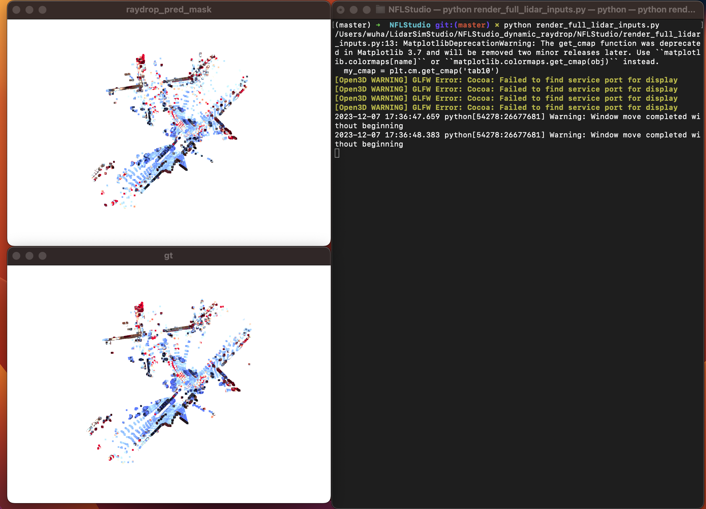

## Dynamic LiDAR Re-simulation using Compositional Neural Fields
This repository represents the official implementation of the paper:

### [Dynamic LiDAR Re-simulation using Compositional Neural Fields](https://arxiv.org/abs/2312.05247)

[Hanfeng Wu<sup>1,2</sup>](https://www.linkedin.com/in/hanfeng-wu-089602203/), [Xingxing Zuo<sup>2</sup>](https://xingxingzuo.github.io/), [Stefan Leutenegger<sup>2</sup>](https://www.professoren.tum.de/leutenegger-stefan), [Or Litany<sup>3</sup>](https://orlitany.github.io/), [Konrad Schindler<sup>1</sup>](https://prs.igp.ethz.ch/group/people/person-detail.schindler.html), [Shengyu Huang<sup>1</sup>](https://shengyuh.github.io) \
<sup>1</sup> ETH Zurich | <sup>2</sup> Technical University of Munich | <sup>3</sup> Technion | <sup>4</sup> NVIDIA

## Introduction
This code consists of two parts. The folder `DyNFL` contains our nerfstudio-based DyNFL implementation. The folder `WaymoPreprocessing` contains the preprocessing scripts to generate dataset used for training and evaluation.

## Enrionment setup
This code has been tested on 
- Python 3.10.10, PyTorch 1.13.1, CUDA 11.6, Nerfstudio 0.3.4, GeForce RTX 3090/GeForce GTX 1080Ti

To create a conda environment and install the required dependences, please run:
```shell
conda create -n "dynfl" python=3.10.10
conda activate dynfl
```
Then install nerfstudio from [official guidelines](https://docs.nerf.studio/quickstart/installation.html) in your conda environment.

After intalling nerfstudio, install DyNFL and required packages as follows:
```
git clone git@github.com:prs-eth/DyNFL-Dynamic-LiDAR-Re-simulation-using-Compositional-Neural-Fields.git
cd DyNFL
pip install -e .

pip install NFLStudio/ChamferDistancePytorch/chamfer3D/
pip install NFLStudio/raymarching/
```

## Prepare Datasets
Please refer to [WaymoPreprocessing](./WaymoPreprocessing).

## Training
After generating the datasets, please run
```shell
ns-train NFLStudio --pipeline.datamanager.dataparser-config.context_name <context_name> --pipeline.datamanager.dataparser-config.root_dir <path_to_your_preprocessed_data_dynamic> --experiment_name <your_experiment_name>
```
You can set the batch-size in [NFLDataManagerConfig](./DyNFL/NFLStudio/datamanager.py) or pass it as arguments along with the `ns-train` command
## Evaluation and visulization
After training, a folder containing weights will be saved in your working folder as `outputs/<your_experiment_name>/NFLStudio/<time_stamp>/nerfstudio_models`

replace the `load_dir` in [tester](./DyNFL/NFLStudio/tester.py) with `outputs/<your_experiment_name>/NFLStudio/<time_stamp>/nerfstudio_models` and replace `context_name` with <context_name> 

### Quantitative results
In order to get quantitative results, please uncomment in [tester](./DyNFL/NFLStudio/tester.py)
```
# pipeline.get_numbers() # get numbers of the LiDARs
```
and run
```
cd NFLStudio
python tester.py
```

### Visulization
To visulize the results, uncomment in [tester](./DyNFL/NFLStudio/tester.py)
```
# pipeline.get_pcd(context_name) # get pcd to display
```
and run
```
cd NFLStudio
python tester.py
```

After that, you will have a folder in `NFLStudio` called `pcd_out`.

replace the `dir` and `context_name` with `path/to/pcd_out` and <context_name> in [NFLStudio/render_full_lidar_inputs.py](./DyNFL/NFLStudio/render_full_lidar_inputs.py)

and run
```
cd NFLStudio
python render_full_lidar_inputs.py
```
It will generate two windows like follows:

## Citation
```bibtex
@article{Wu2023dynfl,
        title={Dynamic LiDAR Re-simulation using Compositional Neural Fields},
        author={Wu, Hanfeng and Zuo, Xingxing and Leutenegger, Stefan and Litany, Or and Schindler, Konrad and Huang, Shengyu},
        journal={arXiv preprint},
        year={2023}
    }
```
## Acknowledgement
We use the nerfstudio framework in this project, we thank the contributors for their open-sourcing and maintenance of the work. 
